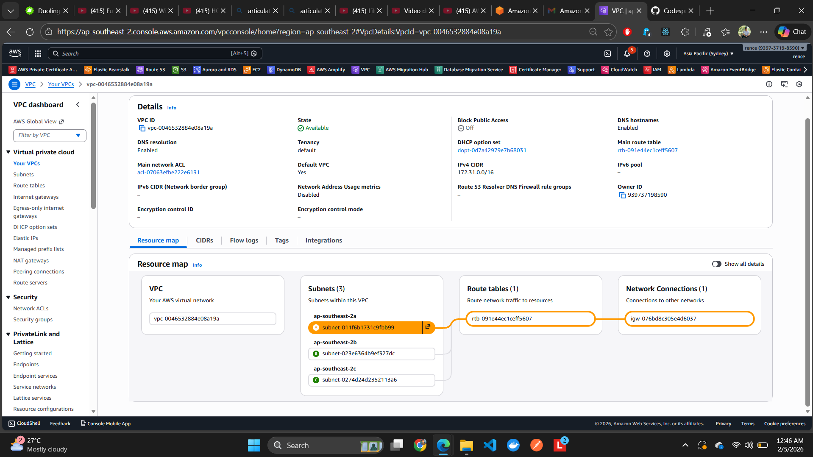
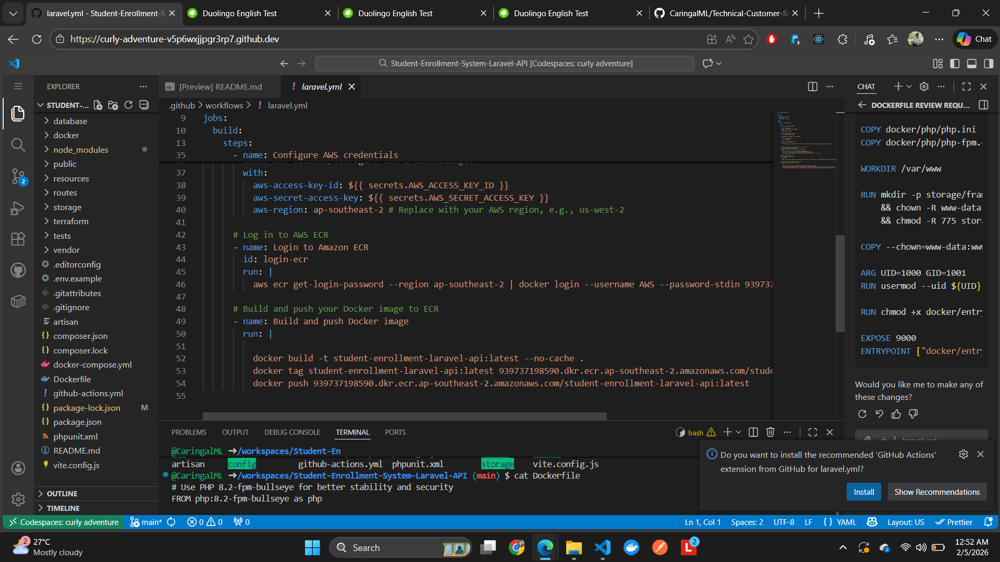
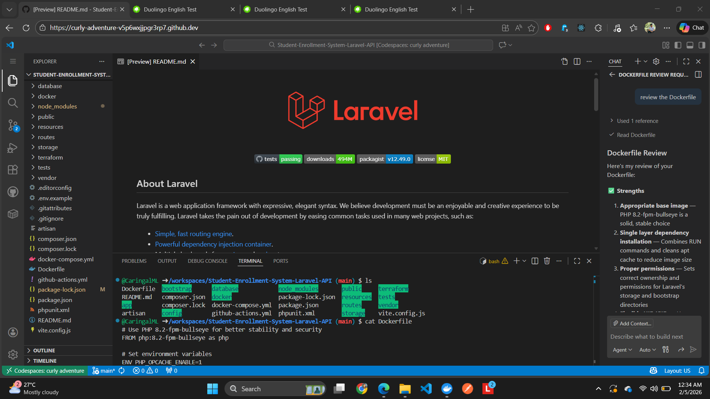
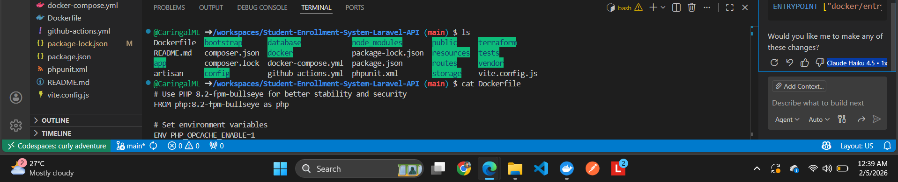
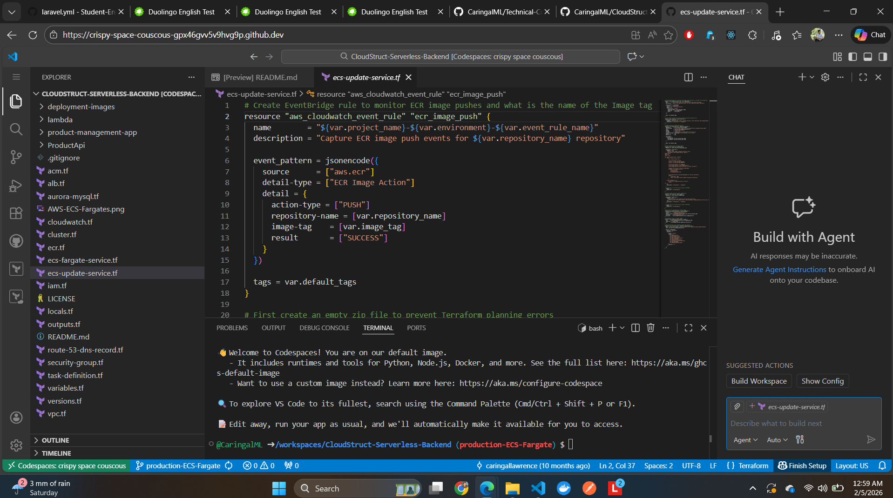

# Technical Customer Support Application - Inviol
## Martin Lawrence Caringal

[-58CC02?style=for-the-badge&logo=duolingo&logoColor=white)](https://certs.duolingo.com/hsvq8l9mix5t2cvi)

---

## 📬 Contact Information
- **Email:** lawrencecaringal5@gmail.com
- **Phone:** 022 124 8553
- **Location:** Hamilton, Waikato, New Zealand
- **Portfolio:** [personal-portfolio-86a9d.firebaseapp.com](https://personal-portfolio-86a9d.firebaseapp.com)
- **Right to Work:** New Zealand Resident

---

## 🎯 Application Purpose

I am applying for the **Technical Customer Support (Int-Snr)** position at **Inviol** - an AI-powered workplace safety startup transforming how industries approach health and safety through cutting-edge computer vision technology.

This repository serves as evidence of my technical capabilities and eagerness to learn the skills required for this role, including **Linux, Docker, networking, bash, SSH, Ubuntu, RTSP feeds, and AI integration**.

---

## 💡 Why Inviol?

Inviol's mission to prevent workplace injuries through AI resonates deeply with me. Having worked as an Advanced Labourer at Downer NZ, I've experienced firsthand the critical importance of workplace safety protocols. The opportunity to combine my IT expertise with meaningful social impact excites me.

Your partnerships with **Woolworths, NZ Post, and Vulcan Steel** demonstrate real-world impact, and I'm eager to help scale these AI-driven safety solutions globally while growing my technical expertise in a fast-paced startup environment.

---

## 🛠️ Technical Evidence & Skills Demonstration

### 1. **AWS Cloud Infrastructure & Networking**

- **Configured AWS Virtual Private Cloud (VPC)** with multiple subnets across availability zones
- Implemented **route tables, internet gateways, and network ACLs**
- Demonstrates understanding of **IP addressing, CIDR blocks, and network segmentation**
- **Relevant to:** Provisioning Linux-based edge AI devices, understanding network configurations

**Skills:** Cloud Computing, VPC, Subnets, Routing, Network Security

---

### 2. **Docker Containerization & Microservices**

- **Managed multi-container applications** using Docker Desktop
- Experience with **container orchestration, port mapping, and resource management**
- Worked with **PHPMyAdmin, MySQL databases, and web APIs** in containerized environments
- **Relevant to:** Understanding Docker for edge AI deployments, container troubleshooting

**Skills:** Docker, Containerization, Microservices Architecture, Database Management

---

### 3. **English Communication Proficiency**

- **Duolingo English Test Score: 110/160 (CEFR B2 - Upper Intermediate)**
- **Individual Scores:**
  - Speaking: 115
  - Writing: 105
  - Reading: 105
  - Listening: 110
- **Relevant to:** Exceptional communication requirement - interacting with technical and non-technical stakeholders

**Skills:** Fluent English Communication, Technical Documentation, Customer Interaction

---

### 4. **CI/CD Pipeline & GitHub Actions**

- **Built automated CI/CD pipelines** using GitHub Actions
- Configured **AWS ECR integration, Docker image builds, and automated deployments**
- Implemented **secure credential management** with AWS access keys and secrets
- **Relevant to:** Workflow management, automation, and improving support processes

**Skills:** CI/CD, GitHub Actions, Automation, DevOps Practices

---

### 5. **Linux Development Environment (Ubuntu/Bash)**

- **Developed in Linux environments** using GitHub Codespaces with Ubuntu
- Experience with **bash scripting, terminal commands, and Laravel framework**
- Configured **PHP, Composer, and web server environments**
- **Relevant to:** Provisioning & Configuration requirement - managing Ubuntu, bash, and SSH

**Skills:** Ubuntu Linux, Bash Scripting, SSH, Command Line Tools, Web Development

---

### 6. **AI Integration & Agentic Automation**

- **Integrated AI agents** (Claude LLM) into terminal workflows for automated file management
- Demonstrated **innovative problem-solving** by combining AI tools with development tasks
- **Relevant to:** Working with cutting-edge AI systems at Inviol, feature assistance for non-technical users

**Skills:** AI Integration, Automation, LLMs, Innovative Problem-Solving

---

### 7. **Infrastructure as Code (Terraform)**

- **Automated AWS infrastructure deployment** using Terraform (Infrastructure as Code)
- Created **EventBridge rules, CloudWatch monitoring, and ECR configurations**
- Managed **security groups, VPCs, and serverless resources**
- **Relevant to:** Workflow management, infrastructure provisioning, and technical automation

**Skills:** Terraform, Infrastructure as Code, AWS EventBridge, CloudWatch, Automation

---

## 🎓 Education & Certifications

### **Bachelor of Science in Information Technology (IQA Level 7)**
**Mindoro State University, Philippines** | June 2018 - August 2022

**Capstone Project:** [ESEEDS - An Automated Agricultural Seeds Vending Machine](https://github.com/CaringalML/ESEEDS-An-Automated-Agricultural-Seed-Vending-Machine)
- Developed hardware-software integration using **Arduino, Python, and sensors**
- Demonstrates ability to work with **embedded systems and automation**

### **AWS Certifications**
1. **[AWS Certified Solutions Architect - Associate (SAA-C03)](https://www.credly.com/badges/b98862af-ff93-442d-81e8-03258924ff4f/public_url)** - February 2025
2. **[AWS Certified Cloud Practitioner (CLF-C02)](https://www.credly.com/badges/97c17453-db53-4390-ae64-1a3a196bcb38/public_url)** - July 2024

---

## 💼 Relevant Work Experience

### **KFC Team Member** | Restaurant Brands Limited
**July 2025 - Present**
- Handle customer inquiries and complaints professionally during high-pressure situations
- Collaborate with team members to ensure efficient operations
- Maintain cleanliness, safety, and food safety standards

**Transferable Skills:** Customer service, communication, problem-solving under pressure

---

### **Advanced Labourer** | Downer NZ - Waikato District Alliance
**February 2024 - July 2025**
- Ensured compliance with **workplace safety rules and regulations**
- Managed **Temporary Traffic Management** for construction zones
- Operated construction machinery and communicated effectively with teams and public

**Transferable Skills:** Workplace safety awareness, teamwork, regulatory compliance

---

## 🔧 Technical Skills Summary

| Category | Skills |
|----------|--------|
| **Cloud Platforms** | AWS (EC2, S3, IAM, VPC, CloudWatch, EventBridge) |
| **Operating Systems** | Ubuntu Linux, Windows, Windows Server |
| **Containerization** | Docker, Docker Compose |
| **Networking** | TCP/IP, DHCP, DNS, IP Addressing, VPC, Subnets |
| **Scripting & Automation** | Bash, Python, PowerShell, Terraform |
| **Version Control** | Git, GitHub, GitHub Actions (CI/CD) |
| **Remote Support Tools** | SSH, RDP, AnyDesk, TeamViewer |
| **Databases** | MySQL, phpMyAdmin |
| **AI Tools** | Claude LLM, AI-powered automation |
| **Frameworks** | Laravel (PHP), Basic RTSP understanding |
| **Soft Skills** | Customer communication, troubleshooting, problem-solving, team collaboration |

---

## 🚀 Key Strengths for Inviol's Technical Support Role

### ✅ **Customer Communication**
- Experience interacting with customers in high-pressure environments (KFC)
- Fluent English communication skills (Duolingo CEFR B2)
- Ability to explain technical concepts to non-technical users

### ✅ **Provisioning & Configuration**
- AWS cloud infrastructure experience (VPC, subnets, security groups)
- Linux environment proficiency (Ubuntu, bash, SSH)
- Docker container management and deployment

### ✅ **Onboarding & Support**
- Technical onboarding experience through university projects
- Remote support tool proficiency (SSH, RDP, AnyDesk)
- Process documentation and workflow improvement mindset

### ✅ **Issue Resolution**
- Troubleshooting hardware, software, and network issues
- Experience diagnosing and resolving technical problems
- AWS infrastructure debugging and optimization

### ✅ **Feature Assistance**
- Helping non-technical users navigate applications
- Creating user guides and documentation
- AI-powered tool integration for enhanced user experience

### ✅ **Workflow Management**
- CI/CD pipeline automation (GitHub Actions)
- Infrastructure as Code (Terraform)
- Process optimization and efficiency improvements

### ✅ **Collaboration**
- Working with engineering teams (demonstrated through GitHub projects)
- Cross-functional collaboration (construction and food service teams)
- Strong team player with proactive communication

---

## 🎯 Learning Commitment

I am **genuinely excited** to learn and master the following technologies that are critical to Inviol's success:

- ✅ **Bash scripting** for automation
- ✅ **Linux (Ubuntu)** system administration
- ✅ **Networking fundamentals** (already have VPC/cloud networking experience)
- ✅ **RTSP feeds** for camera streams
- ✅ **Docker** (already have practical experience)
- ✅ **Security cameras** and surveillance systems
- ✅ **SSH** for remote device management (already proficient)
- ✅ **AI and LLMs** (demonstrated integration experience)
- ✅ **Automation and workflow optimization**

---

## 🌟 Why I'm the Right Fit

1. **Technical Foundation:** AWS certifications and hands-on cloud/Linux experience
2. **Workplace Safety Context:** Firsthand understanding from construction industry
3. **Customer-Facing Skills:** Proven ability to handle inquiries professionally
4. **Innovation Mindset:** Demonstrated through AI integration and automation projects
5. **Eagerness to Learn:** Passionate about mastering new technologies
6. **Startup Mentality:** Self-motivated, detail-oriented, and go-getter attitude
7. **Local Availability:** Hamilton-based, ready for onsite work in Grafton, Auckland

---

## 📄 Additional Resources

- **CV:** [Download CV (PDF)](./CV-17-10-2025-MARTIN-CARINGAL.pdf)
- **Portfolio Website:** [martincaringal.co.nz](https://martincaringal.co.nz)
- **AWS SAA Certification:** [Credly Badge](https://www.credly.com/badges/b98862af-ff93-442d-81e8-03258924ff4f/public_url)
- **AWS CCP Certification:** [Credly Badge](https://www.credly.com/badges/97c17453-db53-4390-ae64-1a3a196bcb38/public_url)
- **Duolingo English Test:** [Certificate](https://certs.duolingo.com/hsvq8l9mix5t2cvi)
- **Capstone Project:** [ESEEDS GitHub Repository](https://github.com/CaringalML/ESEEDS-An-Automated-Agricultural-Seed-Vending-Machine)

---

## 🤝 Let's Connect

I am excited about the opportunity to contribute to Inviol's mission of transforming workplace safety through AI technology. I am ready to bring my technical skills, customer service experience, and passion for innovation to your team.

**Ready to make an impact? Let's talk!**

📧 **Email:** lawrencecaringal5@gmail.com  
📞 **Phone:** 022 124 8553  
🌐 **Portfolio:** [personal-portfolio-86a9d.firebaseapp.com](https://personal-portfolio-86a9d.firebaseapp.com)

---

## 📜 License

This repository is created solely for job application purposes to demonstrate technical capabilities.

---

**© 2026 Martin Lawrence Caringal | All Rights Reserved**